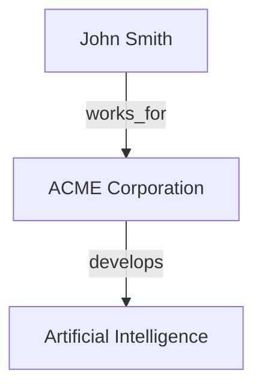

# Model-Choose GraphRAG CLI Full

A powerful GraphRAG (Graph-enhanced Retrieval-Augmented Generation) command-line tool with customizable model selection and multi-company support. Built on LangChain and Ollama, this tool enhances traditional RAG systems with knowledge graph capabilities for more robust document understanding and question answering.

## Features

- **Knowledge Graph Integration**: 
  - Extract entities and relationships from documents automatically
  - Build rich knowledge graphs to represent document connections
  - Thai language support for entity extraction

- **Advanced Retrieval Methods**:
  - Vector search for traditional similarity matching
  - Graph search for relationship-based retrieval
  - Hybrid search combining both approaches for optimal results

- **Visualization**:
  - Visualize knowledge graphs to explore document connections
  - Generate visual explanations of query reasoning paths
  - Support for Thai language in visualizations
  - Export visualizations as Mermaid diagrams for embedding in markdown

- **Model Flexibility**:
  - Choose different LLM and embedding models for different tasks
  - Support for multiple companies or projects with separate configurations

- **Document Processing**:
  - Support for PDF, DOCX, TXT, MD, CSV, XLSX, JSON, and HTML files
  - OCR capabilities for scanned documents using Tesseract or EasyOCR
  - Configurable chunking strategies

- **Raw Mode Analysis**:
  - Examine raw document chunks directly for in-depth analysis
  - Compare retrieval methods with direct access to raw data

## Installation

### Prerequisites

- Python 3.8+
- [Ollama](https://ollama.com/download) installed locally
- Tesseract OCR (optional, for OCR functionality)

### Setup

1. Clone the repository
2. Run the setup script:

```bash
./setup.sh
```

The setup script will:
- Create a virtual environment
- Install required dependencies
- Check for required Ollama models and pull them if needed
- Set up necessary directories

## Performance Considerations

### Retrieval Method Selection

Choosing the appropriate retrieval method depends on your use case:

| Retrieval Method | Performance | Memory Use | Best For |
|------------------|-------------|------------|----------|
| **Vector** | Fastest | Lower | Simple factual queries, general information retrieval |
| **Graph** | Medium | Medium | Relationship queries, connected information, "how" questions |
| **Hybrid** | Slowest | Higher | Complex queries requiring both facts and relationships |

### Raw Chunks Analysis

Using the `--raw-chunks` option with different retrieval methods can reveal insights into how each method works:

#### Vector Retrieval Characteristics

```bash
./run.sh query "Information about product X" --retrieval-method vector --raw-chunks
```

- **What you'll see**: Documents similar to the query based on semantic meaning
- **Strengths**: Good at finding directly relevant content
- **Limitations**: May miss related concepts that use different terminology

#### Graph Retrieval Characteristics

```bash
./run.sh query "Information about product X" --retrieval-method graph --raw-chunks
```

- **What you'll see**: Entities connected to "product X" and their relationships
- **Strengths**: Reveals connections even when terminology differs
- **Limitations**: May include less directly relevant content

#### Hybrid Retrieval Characteristics

```bash
./run.sh query "Information about product X" --retrieval-method hybrid --raw-chunks
```

- **What you'll see**: A combination of semantically similar content and related entities
- **Strengths**: More comprehensive coverage of the topic
- **Limitations**: Can sometimes include tangentially related information

### Optimizing Performance

- For large document collections, increase chunk size to reduce the number of vectors
- For complex questions, use `--num-hops 2` or higher with graph or hybrid retrieval
- For faster responses with less comprehensive results, use vector retrieval
- For detailed entity relationship analysis, use graph retrieval with `--raw-chunks`

## Command Reference and Examples

### Document Ingestion

```bash
# Basic document ingestion
./run.sh ingest path/to/file.pdf

# Ingest all documents in a directory (recursive by default)
./run.sh ingest path/to/documents/

# Ingest and build knowledge graph simultaneously
./run.sh ingest path/to/documents/ --build-graph

# Ingest for a specific company
./run.sh ingest path/to/documents/ --company research

# Ingest with custom model settings
./run.sh ingest path/to/documents/ --embedding-model nomic-embed-text

# Ingest with custom chunk settings
./run.sh ingest path/to/documents/ --chunk-size 1000 --chunk-overlap 100

# Ingest with OCR for scanned documents
./run.sh ingest path/to/scanned_docs/ --ocr

# Ingest documents with Thai OCR
./run.sh ingest path/to/thai_documents/ --ocr --ocr-engine easyocr --ocr-lang tha+eng

# Ingest and build knowledge graph with visualization
./run.sh ingest path/to/documents/ --build-graph --visualize-graph

# Specify LLM model for entity extraction during ingestion
./run.sh ingest path/to/documents/ --build-graph --llm-model phi3
```

### Knowledge Graph Management

```bash
# Build knowledge graph from existing vector store
./run.sh build-graph

# Build graph for a specific company
./run.sh build-graph --company research

# Build graph with custom document selection
./run.sh build-graph --num-docs 100

# Build graph using only documents relevant to a specific topic
./run.sh build-graph --query "artificial intelligence"

# Build and visualize the knowledge graph
./run.sh build-graph --visualize

# Visualize existing knowledge graph
./run.sh visualize-graph

# Visualize with custom maximum nodes
./run.sh visualize-graph --max-nodes 100

# Visualize graph for a specific company
./run.sh visualize-graph --company finance

# Save visualization to specific file
./run.sh visualize-graph --output my-graph.png

# Generate Mermaid diagram instead of PNG image
./run.sh visualize-graph --format mermaid

# Save Mermaid diagram to specific file
./run.sh visualize-graph --format mermaid --output my-graph.md

# Visualize graph with Thai text support
./run.sh visualize-graph --company thai-docs
```

### Querying With Different Retrieval Methods

#### Hybrid Retrieval (Vector + Graph)

```bash
# Basic hybrid retrieval (default)
./run.sh query "What are the key concepts in the documents?"

# Hybrid retrieval with explicit specification
./run.sh query "How do concepts X and Y relate to each other?" --retrieval-method hybrid

# Hybrid retrieval with extended graph traversal
./run.sh query "Explain the relationship network around concept Z" --retrieval-method hybrid --num-hops 2

# Hybrid retrieval with visual explanation
./run.sh query "What connects these ideas?" --retrieval-method hybrid --explain

# Hybrid retrieval with Mermaid diagram explanation
./run.sh query "What connects these ideas?" --retrieval-method hybrid --explain --format mermaid

# Hybrid retrieval with raw chunks display (no LLM processing)
./run.sh query "Find information about topic X" --retrieval-method hybrid --raw-chunks

# Hybrid retrieval with custom model and temperature
./run.sh query "Analyze the relationship between A and B" --retrieval-method hybrid --llm-model llama3:70b --temperature 0.3
```

#### Vector-Only Retrieval

```bash
# Basic vector search
./run.sh query "What does the document say about X?" --retrieval-method vector

# Vector search with raw chunks display
./run.sh query "Find mentions of concept Y" --retrieval-method vector --raw-chunks

# Vector search with more results
./run.sh query "Comprehensive information on topic Z" --retrieval-method vector --num-chunks 10

# Vector search with specific embedding model
./run.sh query "Technical details of process X" --retrieval-method vector --embedding-model nomic-embed-text
```

#### Graph-Only Retrieval

```bash
# Basic graph search
./run.sh query "How are entities X and Y connected?" --retrieval-method graph

# Graph search with extended traversal
./run.sh query "Find all relations to entity Z" --retrieval-method graph --num-hops 3

# Graph search with raw data inspection
./run.sh query "Show me the entity network for concept X" --retrieval-method graph --raw-chunks

# Graph search with visual explanation
./run.sh query "Map the connections between these concepts" --retrieval-method graph --explain
```

### Raw Chunks Analysis for Different Retrieval Methods

```bash
# Examine raw document chunks with vector search
./run.sh query "Information about X" --retrieval-method vector --raw-chunks

# Examine raw document chunks with graph search
./run.sh query "Entities related to Y" --retrieval-method graph --raw-chunks

# Examine raw document chunks with hybrid search
./run.sh query "Comprehensive overview of Z" --retrieval-method hybrid --raw-chunks

# Get more raw chunks for detailed analysis
./run.sh query "Detailed information on topic X" --raw-chunks --num-chunks 15

# Get raw chunks for a specific company
./run.sh query "Find mentions of product Y" --company product-team --raw-chunks
```

### Custom Templates and Models

```bash
# Query with custom prompt template
./run.sh query "Analyze this topic" --template prompts/expert_analysis.txt

# Query with specific LLM model
./run.sh query "Technical explanation of concept X" --llm-model phi3

# Query with specific embedding model
./run.sh query "Find similar concepts to Y" --embedding-model nomic-embed-text

# Query with adjusted temperature (creativity)
./run.sh query "Creative connections between concepts" --temperature 0.8

# Query with precise, deterministic response
./run.sh query "Exact factual information about X" --temperature 0.1
```

### Company Management

```bash
# List all companies
./run.sh company --list

# Add a new company
./run.sh company --add --id research --name "Research Department"

# Add a company with custom models
./run.sh company --add --id finance --name "Finance Team" --llm-model llama3:70b --embedding-model nomic-embed-text

# Add a company and set as active
./run.sh company --add --id marketing --name "Marketing Team" --set-active

# Remove a company
./run.sh company --remove --id old-project

# Set active company
./run.sh company --set-active --id research

# Show active company details
./run.sh company --show-active

# Update company models
./run.sh company --set-models --id research --llm-model phi3 --embedding-model nomic-embed-text
```

### Model and System Settings

```bash
# List available LLM models
./run.sh model --list-llm

# List available embedding models
./run.sh model --list-embeddings

# List all available models
./run.sh model --list-all

# Show current system settings
./run.sh model --show-settings

# Set default LLM model
./run.sh model --set-defaults --default-llm llama3:70b

# Set default embedding model
./run.sh model --set-defaults --default-embedding nomic-embed-text

# Set default temperature
./run.sh model --set-defaults --temperature 0.5

# Set default retrieval parameters
./run.sh model --set-defaults --top-k 6

# Set default chunking parameters
./run.sh model --set-defaults --chunk-size 1000 --chunk-overlap 200

# Update multiple settings at once
./run.sh model --set-defaults --default-llm phi3 --default-embedding nomic-embed-text --temperature 0.7 --top-k 8
```

## Architecture and Technical Details

### GraphRAG System Architecture

The system combines traditional vector-based RAG with knowledge graph capabilities for enhanced document understanding:

1. **Document Processing Pipeline**:
   - Document loading and parsing (PDF, DOCX, TXT, MD, CSV, XLSX, JSON, HTML)
   - OCR processing for scanned documents and images (Tesseract or EasyOCR)
   - Text chunking with configurable size and overlap parameters
   - Vector embedding generation using customizable embedding models

2. **Knowledge Graph Construction**:
   - Entity extraction using LLM-based techniques
   - Relationship identification between entities
   - Thai language support with specialized Thai entity extraction
   - Incremental graph building with automatic persistence
   - Visualization capabilities for graph exploration

3. **Retrieval Mechanisms**:
   - **Vector Search**: Traditional similarity-based retrieval using embeddings
   - **Graph Search**: Relationship-based retrieval through graph traversal
   - **Hybrid Search**: Combines vector and graph approaches for comprehensive results
   - Configurable parameters like number of results and traversal depth

4. **Response Generation**:
   - Context-aware response formulation using retrieved documents
   - Graph-enhanced understanding of entity relationships
   - Custom prompt templates for specialized response formatting
   - Adjustable temperature for controlling response creativity
   - Raw chunks mode for direct inspection of retrieved content

5. **Multi-Company Support**:
   - Separate data stores and configurations per company/project
   - Company-specific model selection
   - Independent knowledge graphs for different domains

### Analysis Modes

- **Standard Mode**: Generate complete answers using retrieved context and LLM processing
- **Raw Chunks Mode**: Directly display the retrieved document chunks without LLM processing, useful for:
  - Debugging retrieval effectiveness
  - Comparing different retrieval methods (vector vs. graph vs. hybrid)
  - Examining the exact content being used for answer generation
  - Verifying source information accuracy

### Retrieval Method Comparison

| Method | Strengths | Best For | Example Use Cases |
|--------|-----------|----------|-------------------|
| **Vector** | Fast, works with any content | General information retrieval | "What does the document say about X?" |
| **Graph** | Captures relationships, follows connections | Relationship queries | "How are X and Y connected?" |
| **Hybrid** | Comprehensive, combines both approaches | Complex queries | "Explain how X relates to Y and impacts Z" |

## Advanced Usage

### Working with Raw Chunks

The `--raw-chunks` option is particularly useful for analyzing how different retrieval methods work and for directly examining the information retrieved from your documents. This section provides more details on using this feature effectively.

#### Use Cases for Raw Chunks

1. **Retrieval Method Comparison**:
   ```bash
   # Compare what vector search retrieves
   ./run.sh query "Information about concept X" --retrieval-method vector --raw-chunks
   
   # Compare what graph search retrieves
   ./run.sh query "Information about concept X" --retrieval-method graph --raw-chunks
   
   # Compare what hybrid search retrieves
   ./run.sh query "Information about concept X" --retrieval-method hybrid --raw-chunks
   ```

2. **Debugging and Analysis**:
   ```bash
   # Examine why an answer might be incomplete
   ./run.sh query "Detailed information on topic Y" --raw-chunks
   
   # Check if relevant information is being retrieved
   ./run.sh query "Specific details about Z" --raw-chunks --num-chunks 15
   ```

3. **Source Verification**:
   ```bash
   # See the exact sources being used for an answer
   ./run.sh query "What does the document say about policy X?" --raw-chunks
   ```

4. **Knowledge Graph Inspection**:
   ```bash
   # See what entities and relationships were extracted
   ./run.sh query "Show me all information about entity X" --retrieval-method graph --raw-chunks
   ```

#### Example Output with Raw Chunks

When using the `--raw-chunks` option, the output will look something like this:

```
--------------------------------------------------------------------------------
Top 5 relevant chunks:

Chunk 1 (Source: document1.pdf):
----------------------------------------
Entity: Company XYZ (Type: organization)
Attributes:
- founded: 1995
- headquarters: New York
Relationships:
- develops -> Product A
- employs -> John Smith

Chunk 2 (Source: document2.txt):
----------------------------------------
Product A is the flagship offering of Company XYZ, launched in 2020. It features
advanced AI capabilities and has been deployed in over 100 enterprise customers.
The product was developed under the leadership of John Smith, the chief technology
officer.

...
```

### Thai Language Support

For documents containing Thai text, the system uses specialized entity extraction and supports Thai text in visualizations:

```bash
# Ingest Thai documents and build knowledge graph
./run.sh ingest thai_documents/ --build-graph

# Query with Thai language
./run.sh query "ความสัมพันธ์ระหว่างบริษัท X และบริษัท Y คืออะไร?" --retrieval-method hybrid

# Visualize graph with Thai entities
./run.sh visualize-graph --company thai-docs

# Generate Mermaid diagram with Thai entities
./run.sh visualize-graph --company thai-docs --format mermaid
```

The Thai entity extraction module is designed specifically to handle Thai language characteristics, improving entity and relationship recognition in Thai documents. The visualization system has been enhanced to properly display Thai characters in both PNG images and Mermaid diagrams.

### Mermaid Diagram Export

The system now supports exporting knowledge graphs as Mermaid diagrams, which can be embedded in markdown documents:

```bash
# Generate Mermaid diagram from knowledge graph
./run.sh visualize-graph --format mermaid

# Generate Mermaid diagram with custom output path
./run.sh visualize-graph --format mermaid --output graph.md

# Generate Mermaid diagram during ingestion
./run.sh ingest documents/ --build-graph --visualize-graph --format mermaid

# Generate Mermaid diagram for query explanation
./run.sh query "How are X and Y related?" --explain --format mermaid
```

The generated Mermaid diagrams can be viewed in any markdown viewer that supports Mermaid syntax, such as GitHub, GitLab, or VSCode with the Mermaid extension.

Example Mermaid diagram output:



## License

This project is licensed under the MIT License - see the LICENSE file for details.
